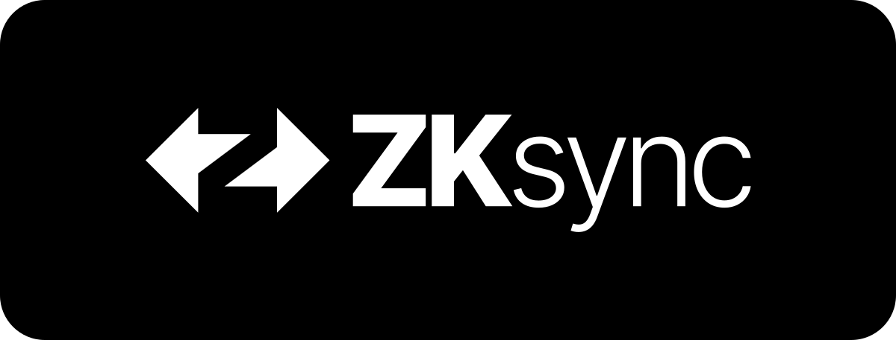

# ZKsync Contracts
```
forge create \
  src/Contract.sol:ICOFactory \
  --zksync \
  --chain 37111 \
  --rpc-url "$ETH_RPC_URL" \
  --private-key "$LENS_CONTRACT_PRIVATE_KEY" \
  --json
{"deployer":"0x5C0D66436cDd4538Cd6EaC475C8BCfeb215A8439","deployedTo":"0x93B418C845C4b654a89a11CfeA9917C2D3F37582","transactionHash":"0xf8c3e557df318204667a2e724baad5ef824ca41d9454bf36c5c6b39d6469b11d"}

```


# 

> [!WARNING]
> This project is provided on the best effort basis and might not accurately reflect contracts that are deployed on any particular ZK chain. Proper source of truth is still [era-contracts](https://github.com/matter-labs/era-contracts).

This package contains lightweight subset of ZKsync L1, L2 and system contracts that we consider to be publicly facing. For more details see [era-contracts](https://github.com/matter-labs/era-contracts).

> [!IMPORTANT]
> Current contract snapshot was made for protocol version 27 as taken from commit [90769297e5324b8c9cfaa10eaf146816ad8dcc8b](https://github.com/matter-labs/era-contracts/commit/90769297e5324b8c9cfaa10eaf146816ad8dcc8b)

## Installation

To install with [**Foundry-ZKsync**](https://github.com/matter-labs/foundry-zksync):

```bash
forge install matter-labs/v2-testnet-contracts@beta
```

Add the following to the `remappings.txt` file of your project:

```txt
@matterlabs/zksync-contracts/=lib/v2-testnet-contracts/
```

To install with [**Hardhat**](https://github.com/matter-labs/hardhat-zksync):

```bash
yarn add @matterlabs/zksync-contracts@beta
```

## Usage

```solidity
// SPDX-License-Identifier: MIT
pragma solidity ^0.8.20;

import {IPaymaster} from "@matterlabs/zksync-contracts/contracts/system-contracts/interfaces/IPaymaster.sol";

contract MyPaymaster is IPaymaster {
     // IMPLEMENTATION
}
```

## Documentation  

Resources for understanding and working with ZKsync contracts:

- **[Core Overview](https://matter-labs.github.io/zksync-era/core/latest/index.html)** – High-level insights into ZKsync’s architecture and core concepts.  
- **[Foundry-ZKsync Book](https://foundry-book.zksync.io/)** – A comprehensive guide to using Foundry with ZKsync.  
- **[Official Documentation](https://docs.zksync.io/)** – The primary reference for developers building on ZKsync.  
- **[Era Contracts Repo Docs](https://github.com/matter-labs/era-contracts/blob/main/docs/Overview.md)** – Details on the contracts in the `era-contracts` repo.  

## Contract Directories

**`l1-contracts/`** — Contracts deployed on Ethereum Layer 1, responsible for rollup security, cross-chain communication, and governance.

**`l2-contracts/`** — Contracts deployed on Layer 2, handling execution, transactions, and protocol logic.

**`system-contracts/`** — Privileged contracts that facilitate core protocol operations, such as contract deployment, messaging, and account management.

## License

ZKsync Contracts are distributed under the terms of the MIT license.

See [LICENSE-MIT](LICENSE-MIT) for details.

## Official Links

- [Website](https://zksync.io)
- [GitHub](https://github.com/matter-labs)
- [ZK Credo](https://github.com/zksync/credo)
- [X](https://x.com/zksync)
- [X for Devs](https://x.com/zksyncdevs)
- [Discord](https://join.zksync.dev)
- [Mirror](https://zksync.mirror.xyz)
